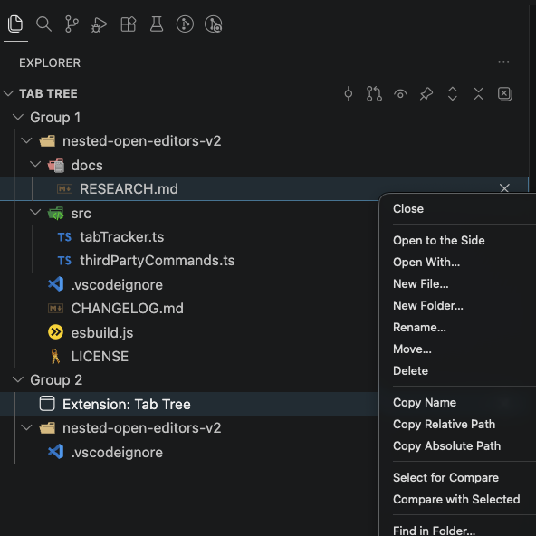

<!-- markdownlint-disable MD033 MD041 -->
<div align="center">


# Tab Tree

[](https://marketplace.visualstudio.com/items?itemName=surranov.tab-tree)
[](https://marketplace.visualstudio.com/items?itemName=surranov.tab-tree)
[](https://marketplace.visualstudio.com/items?itemName=surranov.tab-tree)

**Your open editor tabs, organized as a file tree.**

</div>

> **Note:** Tab Tree is a full rewrite of my earlier extension [Nested Open Editors](https://marketplace.visualstudio.com/items?itemName=surranov.nested-open-editors) (now deprecated) — same author, rebuilt from scratch.

<p align="center">
  
</p>

Tab Tree is a VS Code extension that displays open tabs as a nested folder structure in the Explorer sidebar. Instead of a flat tab bar where `index.ts` appears five times, you see a proper tree with full paths — like your file system, but only showing what's actually open.

## Why

VS Code's built-in "Open Editors" is a flat list. Once you have 10+ tabs, finding the right one means scanning labels and hoping file names are unique. Tab Tree brings the familiar folder hierarchy to your open tabs — the same mental model you already use in the file explorer.

## Features

- **Nested file tree** — open tabs displayed as a folder hierarchy in the sidebar
- **Real-time sync** — tree updates instantly on tab open, close, or switch
- **Split editor support** — separate sections per editor group (Group 1, Group 2, ...)
- **Follow active file** — auto-reveals the currently focused file in the tree
- **Full context menu** — Close, Open to Side, Rename, Move, Delete, Copy Path, New File/Folder, Find in Folder, Reveal in OS, Git Stage/Unstage/Discard/View History, Select for Compare
- **Toolbar buttons** — Collapse/Expand All, Close All, Follow toggle, Preview toggle, Open Git Changes
- **Non-file tabs** — Settings, Keyboard Shortcuts, and other webview tabs appear in the tree
- **Drag and drop** — drag files between editor groups to move tabs (not copy)
- **Multi-root workspaces** — each workspace folder gets its own root node
- **Native file icons & git decorations** — powered by `resourceUri`, inherits your icon theme and git status colors for free
- **Rename with import updates** — renames go through `WorkspaceEdit.renameFile`, so TypeScript and other language servers update imports automatically

## Installation

**VS Code Marketplace:**

1. Open Extensions (`Ctrl+Shift+X` / `Cmd+Shift+X`)
2. Search for **Tab Tree**
3. Click **Install**

**Command line:**

```
code --install-extension surranov.tab-tree
```

## Settings

| Setting                    | Default | Description                                |
| -------------------------- | ------- | ------------------------------------------ |
| `tabTree.followActiveFile` | `true`  | Auto-reveal the active editor in the tree  |

## Requirements

VS Code 1.116.0 or later.

## Contributing

### Setup

```bash
git clone https://github.com/surranov/tab-tree.git
cd tab-tree
npm install
npm run build
```

### Development workflow

```bash
npm run watch          # rebuild on file changes
npm run test:unit      # vitest — 276 unit tests
npm run test:integration  # @vscode/test-electron — 59 integration tests
npm run check          # typecheck + lint + unit tests
```

Press `F5` in VS Code to launch the Extension Development Host with the extension loaded.

### Project structure

```
src/              — extension source code
test/unit/        — vitest unit tests (mocked vscode API)
test/integration/ — @vscode/test-electron integration tests (real VS Code instance)
test/fixtures/    — workspace files used by integration tests
docs/             — project documentation (see below)
```

### Documentation

The `docs/` folder contains the project's technical documentation:

| File | Purpose |
| --- | --- |
| [SPEC.md](docs/SPEC.md) | Full specification — functional requirements, implementation roadmap, testing strategy |
| [DECISIONS.md](docs/DECISIONS.md) | Decision log — every architectural decision with reasoning and rejected alternatives |
| [RESEARCH.md](docs/RESEARCH.md) | Technical research — API capabilities, limitations, VS Code source findings |
| [MAINTENANCE.md](docs/MAINTENANCE.md) | Routine maintenance checklist — VS Code API audit, dependency updates, decision matrix |

These files are the source of truth for the project. When making changes, check if they affect any documented decisions or spec items.

### Running tests

**Unit tests** use [vitest](https://vitest.dev/) with a mocked `vscode` module. They cover tree building, sorting, tab tracking, drag & drop logic, commands, and follow-active-file behavior.

**Integration tests** use [@vscode/test-electron](https://github.com/nicolo-ribaudo/vscode-test-electron) with [Mocha TDD](https://mochajs.org/#tdd). They run inside a real VS Code instance against a fixture workspace and test tab sync, context menu commands, preview tabs, split view, and non-file tabs.

```bash
npm test   # runs both unit and integration tests
```

### Maintenance

Tab Tree depends on the VS Code API surface, which evolves with every monthly release. To keep the extension aligned with the platform, run a maintenance audit roughly every 3–6 months:

1. Open the project in a Claude Code session (`claude` CLI in the project root)
2. Type `/maintenance` and press Enter

The slash-command is defined in [.claude/commands/maintenance.md](.claude/commands/maintenance.md) and points the agent at the full procedure in [docs/MAINTENANCE.md](docs/MAINTENANCE.md). The agent will:

- Read the VS Code release notes for the period since the last update
- Audit Tab Tree's API usage against any breaking changes or deprecations
- Surface new APIs that could simplify existing code
- Check dependencies via `npm outdated` / `npm audit`
- Run the full check cycle and report findings

Maintenance is **advisory** — the agent reports what it found and proposes actions, but never pushes code or publishes on its own. You always review and decide.

## License

[GPL-3.0](LICENSE) — Copyright (c) 2026 surranov
